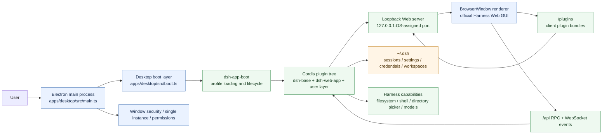
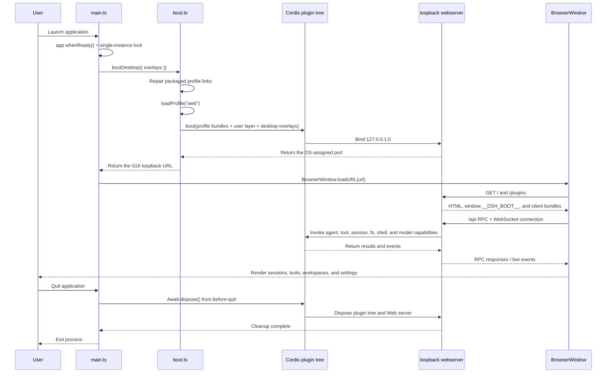

# DeepSeek Harness Desktop

An open-source project that packages [DeepSeek Harness](https://github.com/deepseek-ai/deepseek-harness) — a fully plugin-based agent harness — into **Windows / macOS / Linux** desktop applications. End users do not need Node.js or any CLI tool: download an installer and run.

中文文档: [README.md](README.md)


See the [runtime screenshot gallery](docs/screenshots.md) for additional real application states.

## Quick start

1. Download the installer for your operating system and CPU from [GitHub Releases](https://github.com/paitony/dsh-work/releases).
2. Install and open the app. The packaged desktop app does not need Node.js, pnpm, or any command-line runtime.
3. On first launch, open **Settings → Models**, enter your DeepSeek API key, and save it.
4. Choose a workspace, return to the conversation view, and send your first message.

Harness manages the API key locally through its credentials feature; it is not written to the repository. You can skip model setup if you only want to inspect the interface.

## Features

- **Full feature set**: the renderer is the official harness web GUI — sessions, tool calls, the workspace/folder flow, model and API-key settings, using the same plugin and API composition as `dsh web`;
- **Zero runtime dependencies**: Electron bundles Node; all runtime dependencies and the frontend dist ship inside the installer;
- **Native feel**: application icon, OS-native directory picker, native menus, single-instance, graceful harness shutdown on quit;
- **Cross-platform**: macOS (Intel / Apple Silicon / Universal), Windows, Linux packaging targets;
- **Permission guidance**: startup capability checks (macOS Full Disk Access / Seatbelt, Windows PowerShell) with one-time reminders and links into System Settings;
- **Own data**: sessions, settings and credentials persist under `~/.dsh`; reopening shows all previous runs.

## Installation

Download the matching installer from [GitHub Releases](https://github.com/paitony/dsh-work/releases): `DeepSeek Harness-*-mac-arm64.dmg` for Apple Silicon, `DeepSeek Harness-*-mac-x64.dmg` for Intel Macs, `DeepSeek Harness-*-mac-universal.dmg` for either Mac architecture, `DeepSeek Harness-*-win-x64.exe` for Windows, or the x64 AppImage/deb package for Linux. Official releases must be code-signed and notarized; unsigned local builds may be blocked by Gatekeeper or SmartScreen.

## Building from source

### Prerequisites

- [Node.js](https://nodejs.org/) `^22.19 || >=24` (build-time only; the runtime is bundled by Electron)
- [pnpm](https://pnpm.io/) 11
- Git

### Install and build

```sh
git clone https://github.com/paitony/dsh-work.git
cd dsh-work

pnpm install        # install all workspace dependencies (including Electron)
pnpm run build      # build all harness libraries + the web frontend dist
```

### Development

```sh
pnpm --filter @deepseek-ai/dsh-desktop dev   # compile the desktop shell and launch Electron
pnpm --filter @deepseek-ai/dsh-desktop smoke # headless smoke test (no display needed)
```

## Packaging & release

```sh
pnpm --filter @deepseek-ai/dsh-desktop dist:mac:arm64      # macOS Apple Silicon (dmg + zip)
pnpm --filter @deepseek-ai/dsh-desktop dist:mac:x64        # macOS Intel
pnpm --filter @deepseek-ai/dsh-desktop dist:mac:universal  # macOS universal (fat binary)
pnpm --filter @deepseek-ai/dsh-desktop dist:win            # Windows NSIS installer
pnpm --filter @deepseek-ai/dsh-desktop dist:linux          # Linux AppImage + deb
```

Artifacts land in `apps/desktop/release/`. Release distribution requires code signing and notarization (macOS Developer ID, Windows certificate); unsigned builds are blocked by Gatekeeper / SmartScreen. See `docs/building.md` for CI and signing guidance.

## Architecture

The desktop shell owns Electron lifecycle, window security, permissions, and launch parameters. The harness itself boots in-process through `dsh-app-boot` profile machinery, while the renderer loads the official harness Web GUI over a loopback Web server.

### System architecture



### Runtime logic



### Key code locations

| Stage | Entry point | Responsibility |
|---|---|---|
| Electron shell | `apps/desktop/src/main.ts` | Window, menu, single instance, navigation security, permission reminders, graceful shutdown |
| Harness boot | `apps/desktop/src/boot.ts` | Load the `web` profile, compose bundles and user patches, bind the loopback port |
| Renderer entry | `apps/desktop/src/preload.cts` + `BrowserWindow.loadURL()` | Load the official Harness Web GUI in a sandboxed renderer |
| Capabilities | `packages/host/*`, `packages/fs/*`, `packages/shell/*`, `packages/llm/*` | Provide filesystem, shell, model, session, and related plugin capabilities |
| Desktop packaging | `apps/desktop/electron-builder.yml` | Configure asar, native-module unpacking, platform installers, and icons |

See [docs/architecture.md](docs/architecture.md) for the detailed layering and repository map, [docs/building.md](docs/building.md) for the build/signing/release workflow, and [docs/quality.md](docs/quality.md) for Electron security and lifecycle verification.

## Data & persistence

User data lives in `~/.dsh`, shared with the `dsh` CLI. Harness plugins manage sessions, settings, credentials, and workspaces there; reopening the app shows previous sessions and workspaces automatically. Never commit your `~/.dsh` directory or an API key.

## License

MIT — see [LICENSE](LICENSE). This repository contains source code of [DeepSeek Harness](https://github.com/deepseek-ai/deepseek-harness) (MIT) and the vendored Cordis framework.
