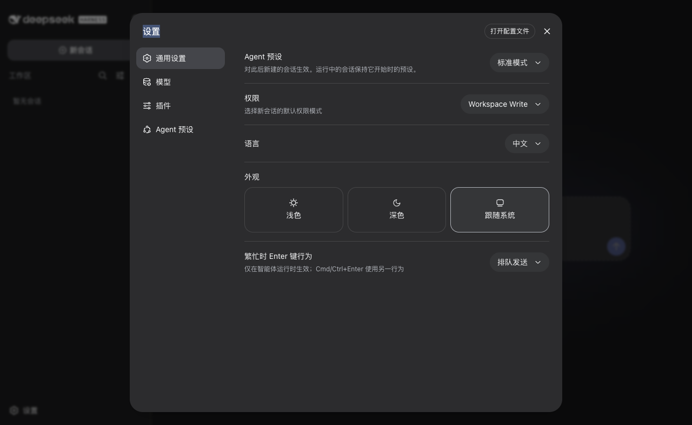
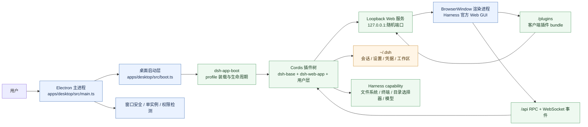
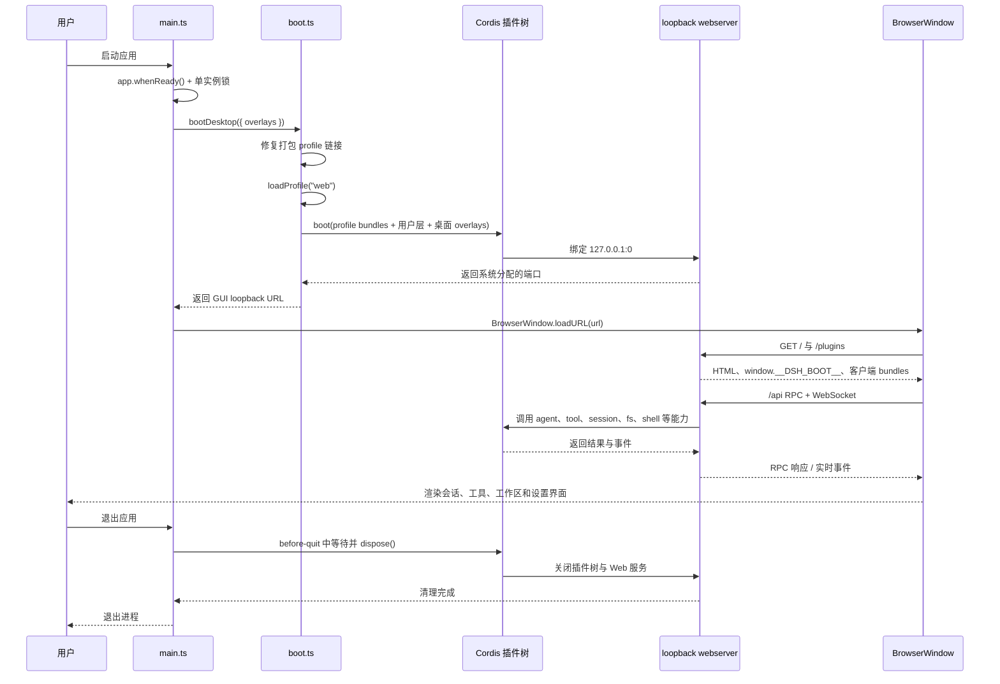

# DeepSeek Harness Desktop

把 [DeepSeek Harness](https://github.com/deepseek-ai/deepseek-harness)（全插件化的开源 Agent Harness）封装为 **Windows / macOS / Linux** 桌面应用的完整开源工程。普通用户无需安装 Node.js 或任何命令行工具：下载安装包、打开即用。

English: [README.en.md](README.en.md)



更多真实运行状态见[软件界面截图](docs/screenshots.md)。

## 5 分钟开始使用

1. 从 [GitHub Releases](https://github.com/paitony/dsh-work/releases) 下载与你的系统和芯片匹配的安装包。
2. 安装并打开应用。下载的桌面版不需要 Node.js、pnpm 或其他命令行环境。
3. 第一次打开后进入「设置 → 模型」，填写 DeepSeek API Key 并保存。
4. 选择一个工作区，回到对话页发送第一条消息。

API Key 由 Harness 的凭据功能在本机管理，不会写进代码仓库；如果你只想浏览界面，可以先跳过模型配置。

## 特性

- **完整功能**：使用 harness 官方 Web GUI —— 会话、工具调用、工作区/文件夹流程、模型与 API Key 设置，与 `dsh web` 共用同一套插件和接口；
- **零运行时依赖**：Electron 内置 Node，应用运行所需的依赖与前端 dist 全部打进安装包；
- **原生体验**：应用图标、系统原生目录选择器、原生菜单、单实例、退出时优雅关闭 harness；
- **跨平台**：macOS（Intel / Apple Silicon）、Windows、Linux 打包目标齐全；
- **权限引导**：启动时自动检测 macOS「完全磁盘访问」/ Seatbelt、Windows PowerShell 等能力缺口并引导设置；
- **数据自持**：会话、设置、凭据持久化在 `~/.dsh`，每次打开都能看到此前的运行记录。

## 安装（最终用户）

从 [GitHub Releases](https://github.com/paitony/dsh-work/releases) 下载对应平台的安装包：

| 平台 | 安装包 | 说明 |
|---|---|---|
| macOS Apple Silicon | `DeepSeek Harness-*-mac-arm64.dmg` | M1/M2/M3/M4 |
| macOS Intel | `DeepSeek Harness-*-mac-x64.dmg` | Intel Mac |
| Windows | `DeepSeek Harness-*-win-x64.exe` | NSIS 安装器 |
| Linux | AppImage / deb | x64 |

> 正式发布的安装包需要代码签名与公证（macOS Gatekeeper、Windows SmartScreen 会拦截未签名包）。

## 从源码构建

### 前置要求

- [Node.js](https://nodejs.org/) `^22.19 || >=24`（仅构建时需要；运行时由 Electron 自带）
- [pnpm](https://pnpm.io/) 11
- Git

### 安装与构建

```sh
git clone https://github.com/paitony/dsh-work.git
cd dsh-work

pnpm install        # 安装全部 workspace 依赖（含 Electron）
pnpm run build      # 构建 harness 全部库 + Web 前端 dist
```

### 开发运行

```sh
pnpm --filter @deepseek-ai/dsh-desktop dev   # 编译桌面包并启动 Electron
pnpm --filter @deepseek-ai/dsh-desktop smoke # 无头冒烟测试（不需要显示器）
```

## 构建与发布

### 打包目标

```sh
pnpm --filter @deepseek-ai/dsh-desktop dist:mac:arm64      # macOS Apple Silicon（dmg + zip）
pnpm --filter @deepseek-ai/dsh-desktop dist:mac:x64        # macOS Intel
pnpm --filter @deepseek-ai/dsh-desktop dist:win            # Windows NSIS 安装器
pnpm --filter @deepseek-ai/dsh-desktop dist:linux          # Linux AppImage + deb
```

产物输出到 `apps/desktop/release/`。macOS 当前发布两个单架构包，因为 Electron 应用包含无法安全合并的架构专用原生模块；Apple Silicon 和 Intel 用户分别下载对应包。

### 发布签名与公证

- **macOS**：需要 Developer ID 证书（`CSC_LINK` / `CSC_KEY_PASSWORD`）签名并公证，否则 Gatekeeper 拦截下载与启动。参见 [electron-builder 签名文档](https://www.electron.build/code-signing)；
- **Windows**：需要代码签名证书（`CSC_LINK` 或 signtool）消除 SmartScreen 警告；
- **CI**：GitHub Actions 会在 macOS、Windows、Linux runner 上分别构建和验收；推送 `vX.Y.Z` 或 `vX.Y.Z-rc.N` 标签会按标签版本创建 GitHub Release，具体目标和签名 secrets 以 `.github/workflows/` 和 `docs/building.md` 为准。

<details>
<summary>面向开发者：内置 Plugins 能力清单</summary>

桌面端继承了 harness 的全部插件能力（`packages/bundle/base` 组合），并按平台启用：

| 能力 | 插件 | 说明 |
|---|---|---|
| 对话与代理 | `dsh-agent`、`dsh-agent-loop`、`dsh-session` | 会话、步骤循环、持久化日志 |
| 模型接入 | `dsh-llm`、`dsh-llm-deepseek`、`dsh-llm-pi-ai` | DeepSeek 官方适配器 + 模型目录 |
| 工具集 | `dsh-tools`、`dsh-tool-bash`、`dsh-tool-fs`、`dsh-tool-fs-search`、`dsh-tool-web`、`dsh-tool-todo`、`dsh-tool-skill`、`dsh-tool-subagent`、`dsh-tool-workflow`、`dsh-tool-goal` | 终端、文件、搜索、网页、任务清单、技能、子代理、工作流 |
| 文件系统 | `dsh-fs-local`、`dsh-fs-sandbox`、`dsh-fs-observation-policy` | 读写、策略、观察 |
| 终端 | `dsh-terminal-bash`、`dsh-pwsh-local` | macOS/Linux bash、Windows PowerShell |
| 沙箱 | `dsh-sandbox-local` | macOS Seatbelt / Linux bwrap+Landlock / Windows ACL 受限令牌 |
| 子代理 | `dsh-subagent`（fork/spawn in-process） | 并行任务委派 |
| 工作流 | `dsh-workflow` + worker-thread 提供方 | 多代理编排 |
| 目标与规划 | `dsh-goal`、`dsh-plan-mode`、`dsh-command-goal` | 长目标、计划模式 |
| 权限与审批 | `dsh-permission-presets`、`dsh-user-approval`、`dsh-sandbox-policy` | 权限模式、审批交互 |
| 凭据与设置 | `dsh-credentials-local`、`dsh-settings-file` | API Key 与配置持久化 |
| 技能 | `dsh-skill`、`dsh-skill-filesystem` | 可复用工作流技能 |
| 搜索 | `dsh-web-search-deepseek` | 内置网页搜索 |
| 会话导出 | `dsh-session-log-export` | 会话日志下载/导出 |

同时随包内置 **agent 预设**（`apps/desktop/config/agent-presets`）：`standard`（默认）、`code`、`cordis`、`minimal`，首次会话自动使用 `standard`。

</details>

## 权限

应用启动时会自动检测系统能力缺口（仅提示，不阻塞启动），每个问题只提醒一次，并提供直达系统设置面板的按钮：

- **macOS · 完全磁盘访问**：在「桌面 / 文稿 / 下载」等受保护目录下工作需要授权（系统设置 → 隐私与安全性 → 完全磁盘访问）；
- **macOS · Seatbelt**：部分 macOS 版本移除了 `sandbox-exec`，此时终端命令工具会被禁用，需要切换权限模式；
- **Windows · PowerShell**：PowerShell 工具需要 pwsh 7 或 Windows 自带 PowerShell 5.1。

## 数据与持久化

用户数据统一存放在 `~/.dsh`（与 `dsh` CLI 共享）。会话、设置、凭据和工作区都由 Harness 的对应插件管理；再次打开应用会自动显示此前的会话与工作区。不要把自己的 `~/.dsh` 目录或 API Key 提交到 Git。

## 架构

桌面端只负责 Electron 壳、生命周期、安全策略和启动参数；Harness 本身仍在 Electron 主进程内按 `dsh-app-boot` 的 profile 机制运行。渲染进程加载 Harness 官方 Web 前端，通过本机 loopback Web 服务访问同一棵 Cordis 插件树。

### 整体架构图



### 代码运行逻辑图



### 关键代码位置

| 阶段 | 入口 | 作用 |
|---|---|---|
| Electron 壳 | `apps/desktop/src/main.ts` | 窗口、菜单、单实例、导航安全、权限提醒、优雅退出 |
| Harness 引导 | `apps/desktop/src/boot.ts` | 装载 `web` profile、组合 bundle 和用户 patch、绑定 loopback 端口 |
| 渲染入口 | `apps/desktop/src/preload.cts` + `BrowserWindow.loadURL()` | 在沙箱渲染进程中加载官方 Harness Web GUI |
| 能力实现 | `packages/host/*`、`packages/fs/*`、`packages/shell/*`、`packages/llm/*` | 提供文件、终端、模型、会话等插件能力 |
| 桌面打包 | `apps/desktop/electron-builder.yml` | asar、原生模块解包、平台安装包和图标配置 |

更完整的分层、目录结构和构建细节见 [docs/architecture.md](docs/architecture.md)；构建矩阵、签名、公证和 GitHub Actions 发布流程见 [docs/building.md](docs/building.md)；Electron 生命周期、安全边界和验证证据见 [docs/quality.md](docs/quality.md)。

## 常见问题

- **打开后没有模型或无法发送消息**：进入「设置 → 模型」，添加 DeepSeek API Key，并确认选择了可用模型。
- **打开后提示“安全沙箱不可用”**：当前 macOS 未提供 `sandbox-exec`。可在设置中把权限模式切换到“完全访问”后重试，或升级 macOS。
- **无法写入桌面/文稿/下载**：在系统设置中为 DeepSeek Harness 开启「完全磁盘访问」。
- **Windows 上终端工具不可用**：安装 [PowerShell 7](https://github.com/PowerShell/PowerShell/releases)。
- **杀毒/防火墙拦截**：应用只监听 `127.0.0.1` 随机端口，不开放对外服务；请确认安全软件未隔离安装包。

## 贡献

见 [CONTRIBUTING.md](CONTRIBUTING.md)。

## License

MIT —— 见 [LICENSE](LICENSE)。本仓库包含 [DeepSeek Harness](https://github.com/deepseek-ai/deepseek-harness)（MIT）的源代码与 vendored Cordis 框架。
