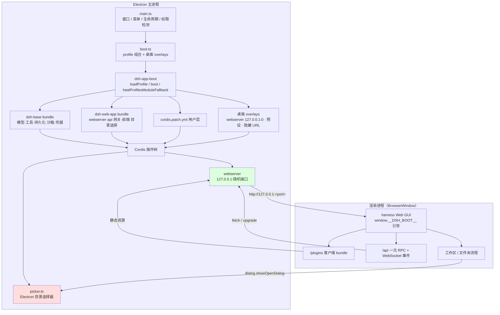
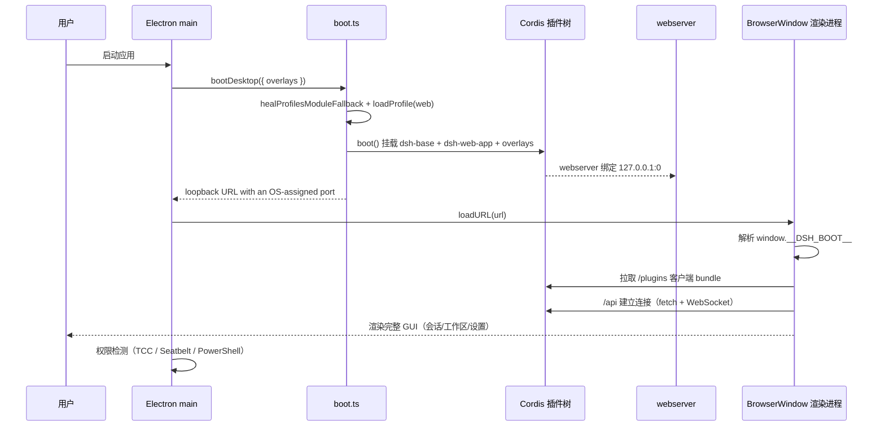

# 架构

DeepSeek Harness Desktop 把 [DeepSeek Harness](https://github.com/deepseek-ai/deepseek-harness)（一个基于 Cordis 的全插件化 Agent Harness）封装成 Windows / macOS / Linux 桌面应用：



## 分层

| 层 | 职责 | 关键代码 |
|---|---|---|
| Electron 壳 | 窗口、菜单、生命周期、单实例、权限检测、诊断日志 | `apps/desktop/src/main.ts` |
| 引导层 | profile 组合、桌面 overlays、agent 预设、asar 链接修复、错误解包 | `apps/desktop/src/boot.ts` |
| 宿主层 | 复用 `dsh-app-boot` 的 profile 机制，进程内引导与 `dsh web` 相同的插件树 | `packages/boot/app-boot` |
| 组合层 | `dsh-base` + `dsh-web-app` bundles + 用户 `cordis.patch.yml` + 桌面 overlays | `packages/bundle/*` |
| 传输层 | harness 自带 loopback webserver（静态 dist + `/api` 网关 + WebSocket） | `packages/host/webserver`、`packages/host/apiproxy` |
| 渲染层 | harness 官方 Web 前端（`apps/web` 构建的 dist），所有功能与浏览器一致 | `apps/web`、`packages/client/*` |

## 启动时序



## 目录结构

```text
dsh-work/
├── apps/
│   ├── desktop/          # 本仓库：Electron 桌面壳
│   │   ├── src/          #   main / boot / picker / preload / permissions
│   │   ├── config/       #   agent-presets（standard/code/cordis/minimal）
│   │   └── tests/        #   无头冒烟测试
│   ├── cli/              # dsh CLI（dsh web 等）
│   └── web/              # Web 前端构建入口（Vite）
├── packages/             # harness 全部插件包（按能力分组）
│   ├── core/             #   session / agent / tools / system-prompt
│   ├── host/             #   webserver / apiproxy / directory-picker
│   ├── client/           #   浏览器端插件（会话 UI、工具视图、设置）
│   ├── bundle/           #   dsh-base / dsh-web-app 组合包
│   └── ...               #   llm / fs / shell / sandbox / credential 等
├── vendor/               # vendored Cordis 框架
├── scripts/              # 构建与校验脚本
├── patches/              # node-pty 等补丁
├── docs/                 # 本文档
└── package.json          # pnpm workspace 根

## 关键设计决策

- **进程内引导**：Electron 主进程直接引导 harness（复用 `dsh-app-boot`），无子进程、无端口解析；
- **渲染层零改动**：加载 harness 官方 Web 前端，所有功能（会话、工具、文件夹、模型设置）与 `dsh web` 逐字节一致；
- **目录选择器走能力缝**：通过 `directory-picker` seam 提供 Electron 原生对话框，替代 osascript/zenity 子进程；
- **Electron 环境适配**：`--expose-internals` + execArgv 镜像（vendored loader 依赖 Node 内部模块）；
- **打包适配**：完整依赖闭包 asarUnpack（符号链接无法穿越 asar）、预设随包挂载、`singleArchFiles` 处理原生模块的双架构合并。
