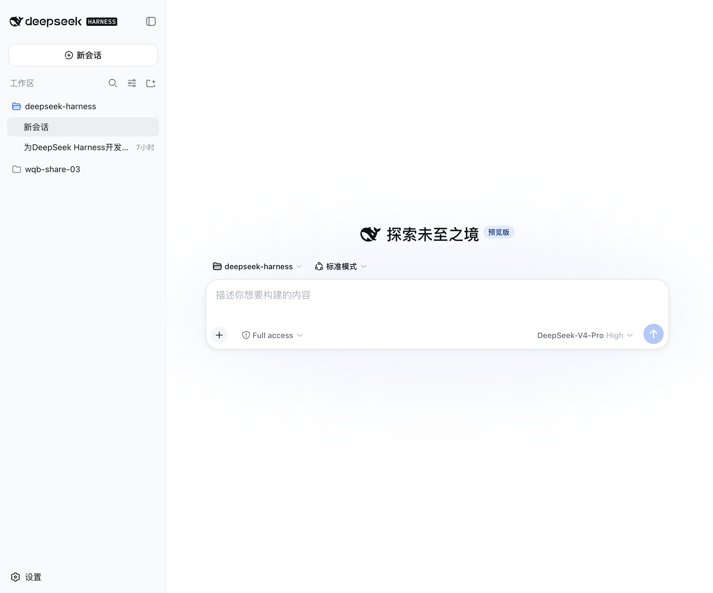
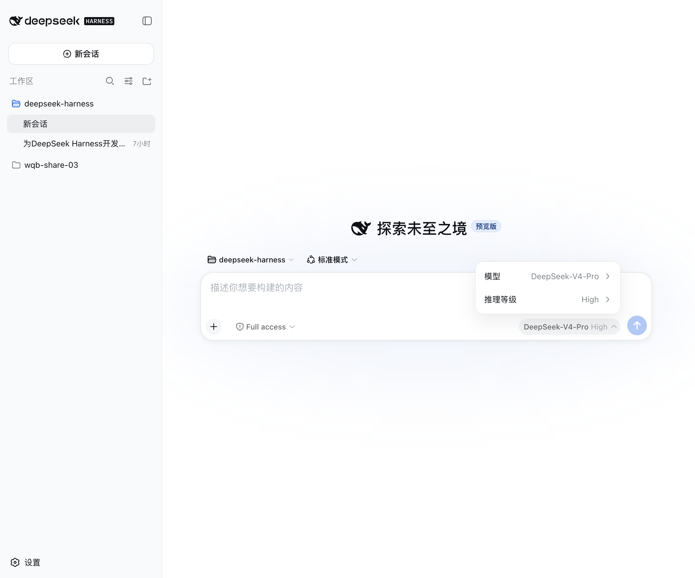
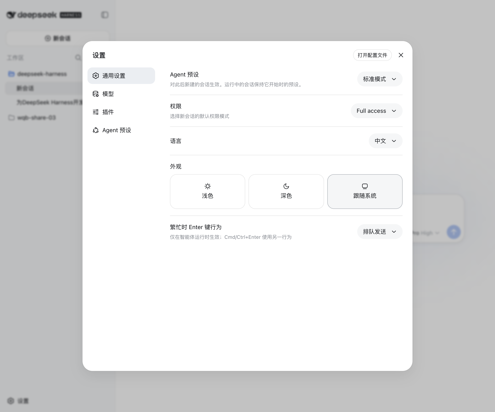
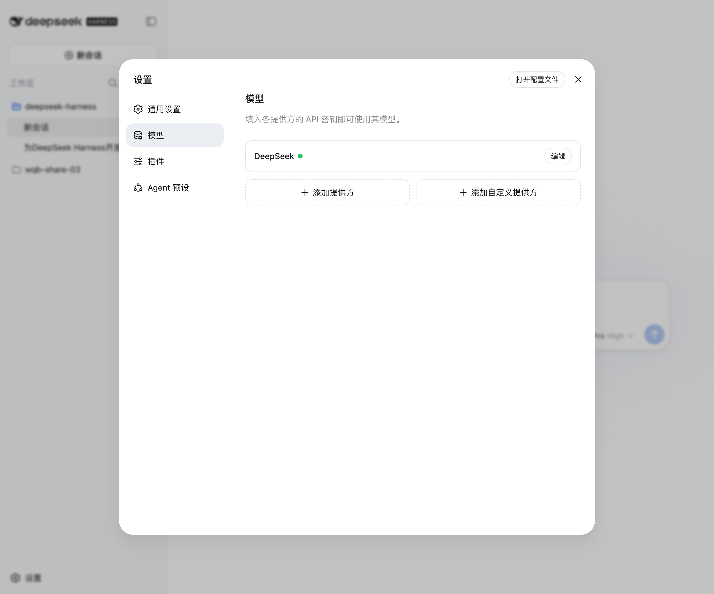
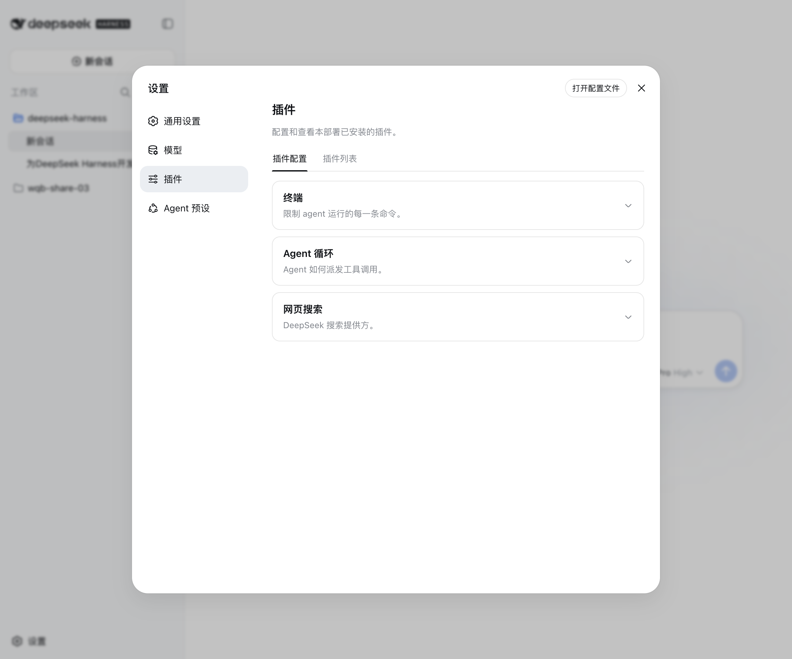
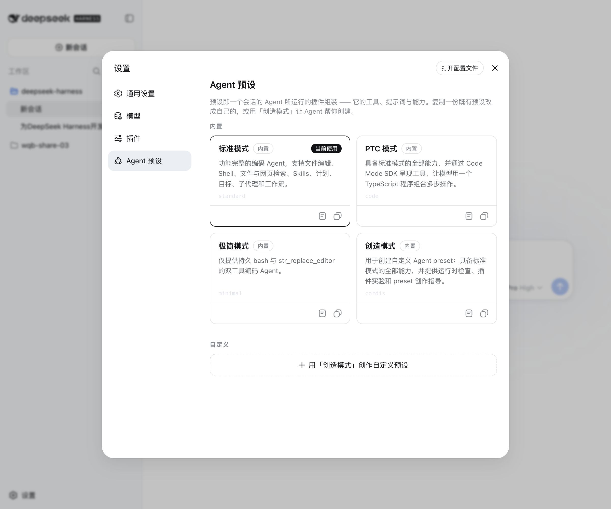

# 软件运行截图 / Runtime screenshots

以下图片来自实际运行的 DeepSeek Harness Desktop，不是设计稿或网页 mock。`desktop-main-window.png` 是打包后的 Electron 窗口截图；`assets/screenshots/` 中的图片来自真实 Electron 会话的 loopback 渲染页面，覆盖主界面、模型、插件、Agent 预设和模型选择器等状态。

截图不会展示 API Key 内容；模型设置页只显示提供方已配置的状态。重新运行桌面端并按下列界面操作即可得到等价状态。

## 主界面

## 设置

